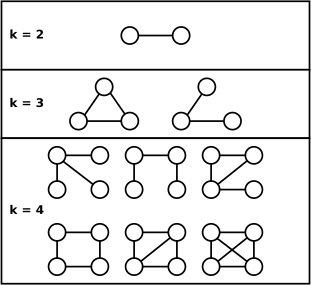

# ParaDyMS - Parallel Dynamic Motif Search

Motifs, or graphlet,s are small subgraphs in a larger network. Identifying and computing their frequency can characterize networks and have seen use in biology, chemistry, social networks, and software engineering.
While many other motif counting methods can scale to large networks, they fail to count for real-world dynamic networks. Indeed, many datasets and networks are often updated over time, presenting a challenge for traditional graph algorithms that assume a static dataset. 
This project aims to compute the frequency k<=4 sized motifs in batched fully-dynamic networks in parallel. Moreover, using the Kokkos C++ Performance Portability Ecosystem, it can run on both the CPU (OpenMp) as well as the GPU (Cuda). 

More information can be found in our paper at CCGrid25:

> Khan, Ali, Tan, Nigel, Marquez, Jack, Taufer, Michela, & Bhowmick, Sanjukta (2025, May). ParaDyMS: Parallel Dynamic Motif Counting at Scale. In 2025 IEEE 25th International Symposium on Cluster, Cloud and Internet Computing (CCGrid) (pp. 01-10). IEEE. doi: [10.1109/CCGRID64434.2025.00046](https://doi.org/10.1109/CCGRID64434.2025.00046)




# Installation

## Dependencies

Requires cmake 3.21+ and [Kokkos 4.4](https://kokkos.org/kokkos-core-wiki/#) to be installed and built against OpenMP 4.5+ and/or Cuda 11/12 and `Kokkos_ROOT` to be set.

## Building
We recommend the following to build and install ParaDyMS locally. The executables `paradyms` and `dyngraph` will be installed in `./bin/`

```bash
cmake -B build -S . -DCMAKE_INSTALL_PREFIX=$PWD -DCMAKE_BUILD_TYPE=Release 

cmake --build build/ --clean-first && cmake --install build
```

Note that the backend used is dependent on Kokkos. However, if Kokkos is built against both OpenMP and Cuda, you can use the cmake flag `-DEXECSPACE` to explicitly specify the execution space to either `OPENMP` or `CUDA`.

# Running ParaDyMS
## CLI Interface
You can execute ParaDyMS with `--help` to see the list of options
```bash
Usage: ./paradyms -s path [-i path] [-d path] [-sc path] [-n int] [(-v | --verbose)] [(-h | --help)]

        =================================================================================
        PARADYMS - Parallel Dynamic Motif Search
        =================================================================================
        -s              Path to edgelist
        -i              Path to insertion edgelist
        -d              Path to deletions edgelist
        -sc             Path to static counts file
                        Disables counting on static graph
        -n              Number of threads (default 1)
        -v --verbose            Verbosity level [0,2] (Default 1)
        -h --help               Print help message

```
## Examples
Count graphlets in a static graph with 1 thread:
```bash
./bin/paradyms -n 1 -s data/karate.edgelist
```
Count graphlets in dynamic (inserted edges only) graph with 1 thread:
```bash
./bin/paradyms -n 1 -s data/wikivote.edgelist -i data/Ins50/ins_wikivote.edgelist
```
Count graphlets in fully-dynamic graph with 8 threads:
```bash
./bin/paradyms -n 8 -s data/wikivote.edgelist -i data/Ins50/ins_wikivote.edgelist -d data/Ins50/del_wikivote.edgelist -sc data/static_counts/static_wikivote.counts 
```
Count graphlets in fully-dynamic graph for GPU (assuming Kokkos is built with it):
```bash
./bin/paradyms -v 1 -s data/wikivote.edgelist -i data/Ins50/ins_wikivote.edgelist -d data/Ins50/del_wikivote.edgelist -sc data/static_counts/static_wikivote.counts 
```

You can set the verbosity of the progam with `-v 1` or `-v 2`. Note that it is not recommended to set the verbosity to more than 1 if the network is large since it will print out the network.

You can optionally prevent spending time to count the static graph by giving the static counts directly to the program by `-sc [path to counts file]`.


## Dataset Preprocessing

We provide a Python-based command line tool to preprocess graphs into the correct edgelist format. It requires the path to the input graph to be processed and the path to store the cleaned edgelist file. It also supports converting files in graphml format (which requires the networkx Python package).

E.g.
```bash
python utils/sanitize.py data/karate_raw.edgelist data/karate.edgelist
```

To print out the help menu and supported options:
```bash
python utils/sanitize.py -h
```

## Generating Dynamic Graphs
We also provide the tool  `dyngraph` to quickly create dynamic graphs. The generated graphs do not require any Just feed in the original graph, output directoy, number of edges in the update, and the percentage of inserted edges in the update. This creates up to three files: static edges and  inserted edges and/or deleted edges. 

```
./bin/dyngraph source output_dir batch_size insertion_ratio seed
```

Example to create an update of 1000 edges with half the edges as inserted edges and half as deleted edges, and run with a random seed:
```bash
./bin/dyngraph data/wikivote.edgelist data/Ins50 1000 50 42
```


# Copyright and License
Copyright (c) 2025, University of North Texas and Global Computing Lab

ParaDyMS is distributed under terms of the Apache License, Version 2.0 with LLVM Exceptions.

See LICENSE for more details.